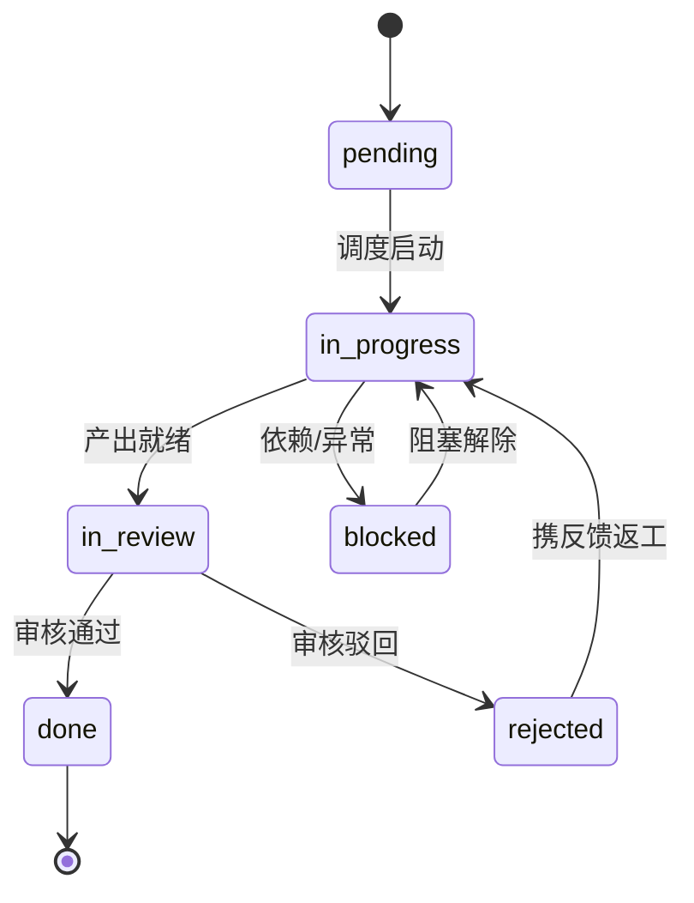
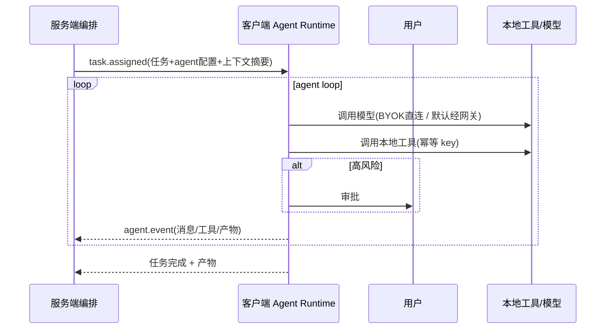
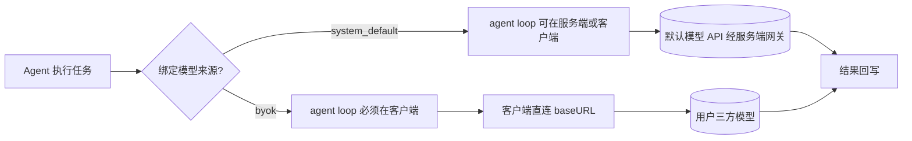
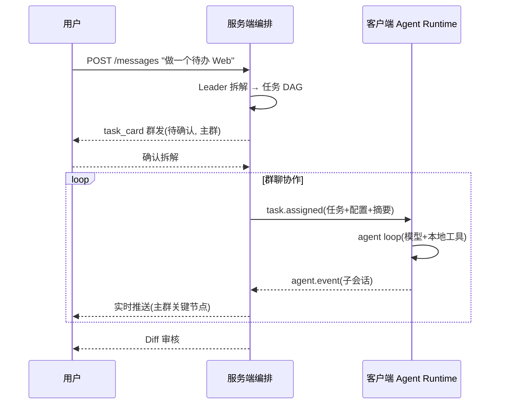
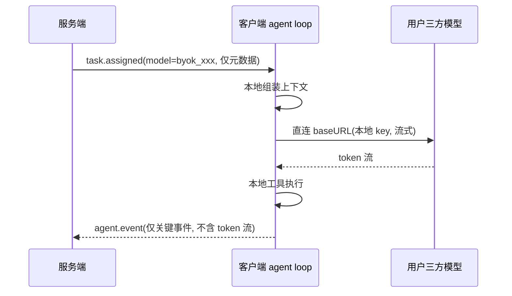

# chatcoder 技术设计文档

| 项 | 内容 |
|---|---|
| 版本 | v0.2 |
| 日期 | 2026-07-24 |
| 关联文档 | [PRD.md](./PRD.md) |

---

## 0. 修订记录

| 版本 | 日期 | 变更摘要 |
|---|---|---|
| v0.1 | 2026-07-24 | 初稿：C/S 架构 + Java/Python 双后端 + gRPC |
| v0.2 | 2026-07-24 | 审查修正：① **MVP 改 Python 单后端（预留 Java 网关拆分点）**；② **BYOK 改方案 A：agent loop 下沉客户端**，新增「客户端 Agent Runtime」章节；③ WS 通道加幂等协议；④ 并发文件锁改客户端进程内；⑤ `agents` 表拆为模板 + 实例；⑥ 代码 embedding 在客户端；⑦ LangGraph 分层使用（DAG 编排） + 自研调度（发言权） |
| v0.3 | 2026-07-25 | Phase 2 端到端闭环实现：① 新增「SessionScheduler 并行层调度」；② 新增「ToolExecutor + 审批门」工具链路；③ `turn_scheduler` 重构为 `BudgetTracker`（speaker token 暂停）；④ `init_db` + 幂等种子；⑤ `ModelRegistry` 按 agent.model_id 路由；⑥ 计划确认门 `session.plan_confirmed`；⑦ 新增 `POST /sessions/{id}/plan/confirm` 与 `/schedule` 端点 |

---

## 1. 概述与技术栈

核心原则：**服务端负责编排与调度，客户端负责执行与本地推理**。

| 层 | MVP | 演进（按需） |
|---|---|---|
| 客户端 | React Web UI（先验证体验） | Electron + React + Monaco 桌面端 |
| 服务端 | **Python 单后端（FastAPI 兼顾网关 + 编排）** | 拆出 **Java 网关**（Spring Boot）承担并发 / 多租户 |
| 编排 | LangGraph（任务 DAG） + 自研调度（发言权 / 动态协作） | 同 |
| 通信 | REST + WebSocket（含幂等） | + gRPC（Java ↔ Python） |
| 存储 | PostgreSQL + Qdrant（向量） + Redis | 同 |
| 模型 | 默认模型（服务端代理） + BYOK（客户端 agent loop 直连） | 同 |

> **MVP 不实现 Java 网关与 gRPC**，但服务端代码按「网关层 / 编排层」模块划分，预留拆分点，后续平滑演进。

---

## 2. 组件职责矩阵

| 组件 | 职责 |
|---|---|
| **客户端 UI** | 群聊工作台、编辑器、团队 / 任务管理 |
| **客户端 Agent Runtime（v0.2 核心）** | **agent loop**（思考-决策-调用工具循环）+ 本地工具执行 + **BYOK 模型直连** + 事件上报 |
| **服务端编排（Python）** | 任务编排、会话与发言权调度、RAG、持久化、默认模型网关 |
| Java 网关（演进） | REST/WS 入口、鉴权、多租户、并发调度 |

> **关键**：BYOK 场景下，agent loop **整体在客户端运行**，服务端只下发「任务 + agent 配置 + 上下文摘要」，客户端本地完成「模型调用 + 工具执行」，再把**关键事件**上报服务端。token 流不经服务端。

---

## 3. 数据库设计（PostgreSQL）

> MVP 单租户，所有业务表预留 `tenant_id`。

### 3.1 租户与用户
```sql
CREATE TABLE tenants (
  id BIGSERIAL PRIMARY KEY, name VARCHAR(120) NOT NULL,
  plan VARCHAR(40) DEFAULT 'free', created_at TIMESTAMPTZ DEFAULT now()
);
CREATE TABLE users (
  id BIGSERIAL PRIMARY KEY, tenant_id BIGINT REFERENCES tenants(id),
  email VARCHAR(160) UNIQUE NOT NULL, display_name VARCHAR(80),
  role VARCHAR(20) DEFAULT 'user', created_at TIMESTAMPTZ DEFAULT now()
);
```

### 3.2 团队、Agent 模板与实例（v0.2 拆分）
```sql
CREATE TABLE teams (
  id BIGSERIAL PRIMARY KEY, tenant_id BIGINT REFERENCES tenants(id),
  name VARCHAR(120) NOT NULL, description TEXT,
  leader_agent_id BIGINT, workflow_config JSONB,
  created_at TIMESTAMPTZ DEFAULT now()
);

-- 角色模板：可复用的 agent 定义
CREATE TABLE agent_templates (
  id BIGSERIAL PRIMARY KEY,
  name VARCHAR(80) NOT NULL, role VARCHAR(40),
  system_prompt TEXT, responsibilities JSONB,
  tool_whitelist TEXT[], default_model_level SMALLINT,
  is_public BOOLEAN DEFAULT FALSE, created_at TIMESTAMPTZ DEFAULT now()
);

-- 团队内的 agent 实例（引用模板 + 个性化配置）
CREATE TABLE team_agents (
  id BIGSERIAL PRIMARY KEY, tenant_id BIGINT REFERENCES tenants(id),
  team_id BIGINT REFERENCES teams(id),
  template_id BIGINT REFERENCES agent_templates(id),
  name VARCHAR(80) NOT NULL, avatar VARCHAR(255),
  model_id BIGINT REFERENCES models(id),       -- 绑定模型
  run_location VARCHAR(20) DEFAULT 'client',   -- client | server
  model_params JSONB, knowledge_base_ids BIGINT[],
  collaboration_style VARCHAR(20) DEFAULT 'balanced',
  created_at TIMESTAMPTZ DEFAULT now()
);
```

### 3.3 模型注册
```sql
CREATE TABLE models (
  id BIGSERIAL PRIMARY KEY, tenant_id BIGINT REFERENCES tenants(id),
  name VARCHAR(80) NOT NULL, provider VARCHAR(40), base_url VARCHAR(255),
  intelligence_level SMALLINT DEFAULT 2,  -- 1轻量|2执行|3规划
  context_window INT, price_input_1k NUMERIC(10,4), price_output_1k NUMERIC(10,4),
  source_type VARCHAR(20) NOT NULL,       -- system_default | byok
  is_active BOOLEAN DEFAULT TRUE, created_at TIMESTAMPTZ DEFAULT now()
);
-- BYOK 的 api_key 仅存客户端本地加密；服务端只留 provider/base_url/level 元数据
```

### 3.4 群聊会话与消息
```sql
CREATE TABLE sessions (
  id BIGSERIAL PRIMARY KEY, tenant_id BIGINT, team_id BIGINT,
  title VARCHAR(160), status VARCHAR(20) DEFAULT 'active',
  shared_context JSONB, created_at TIMESTAMPTZ DEFAULT now()
);
CREATE TABLE session_members (
  id BIGSERIAL PRIMARY KEY, session_id BIGINT REFERENCES sessions(id),
  member_type VARCHAR(10) NOT NULL, member_id BIGINT NOT NULL, joined_at TIMESTAMPTZ DEFAULT now()
);
CREATE TABLE messages (
  id BIGSERIAL PRIMARY KEY, session_id BIGINT REFERENCES sessions(id),
  thread_id BIGINT,                       -- v0.2: 子会话(任务级 thread)
  sender_type VARCHAR(10) NOT NULL, sender_id BIGINT,
  msg_type VARCHAR(20) NOT NULL, content JSONB NOT NULL,
  mentions JSONB, parent_message_id BIGINT,
  token_usage INT DEFAULT 0, created_at TIMESTAMPTZ DEFAULT now()
);
CREATE INDEX idx_messages_session ON messages(session_id, created_at);
CREATE INDEX idx_messages_thread ON messages(thread_id) WHERE thread_id IS NOT NULL;
```

### 3.5 任务、DAG、产物、决策
```sql
CREATE TABLE tasks (
  id BIGSERIAL PRIMARY KEY, session_id BIGINT, parent_task_id BIGINT,
  title VARCHAR(200) NOT NULL, description TEXT, acceptance_criteria TEXT,
  assigned_agent_id BIGINT, status VARCHAR(20) DEFAULT 'pending',
  priority SMALLINT DEFAULT 0, artifact_ids BIGINT[],
  token_usage INT DEFAULT 0,
  created_at TIMESTAMPTZ DEFAULT now(), updated_at TIMESTAMPTZ DEFAULT now()
);
CREATE TABLE task_edges (   -- DAG 依赖边，支持运行时增删
  id BIGSERIAL PRIMARY KEY, session_id BIGINT,
  from_task_id BIGINT REFERENCES tasks(id), to_task_id BIGINT REFERENCES tasks(id),
  edge_type VARCHAR(20) DEFAULT 'dependency', handoff_artifact_id BIGINT
);
CREATE TABLE artifacts (
  id BIGSERIAL PRIMARY KEY, task_id BIGINT, version INT DEFAULT 1,  -- v0.2: 产物版本
  type VARCHAR(20), title VARCHAR(200), storage_ref VARCHAR(255), summary TEXT,
  created_at TIMESTAMPTZ DEFAULT now()
);
CREATE TABLE decisions (
  id BIGSERIAL PRIMARY KEY, session_id BIGINT, summary VARCHAR(300),
  rationale TEXT, counter_args TEXT,                 -- v0.2: 魔鬼代言人反对意见
  decided_by VARCHAR(10), status VARCHAR(20) DEFAULT 'proposed', created_at TIMESTAMPTZ DEFAULT now()
);
```

### 3.6 工具调用、审计、知识库
```sql
CREATE TABLE tool_calls (
  id BIGSERIAL PRIMARY KEY, session_id BIGINT, task_id BIGINT, agent_id BIGINT,
  call_key VARCHAR(80) UNIQUE NOT NULL,  -- v0.2: 幂等键(客户端生成, 去重)
  tool_name VARCHAR(60) NOT NULL, args JSONB, result JSONB,
  status VARCHAR(20) DEFAULT 'pending', client_id VARCHAR(60),
  created_at TIMESTAMPTZ DEFAULT now()
);
CREATE TABLE audit_logs (
  id BIGSERIAL PRIMARY KEY, tenant_id BIGINT, actor_type VARCHAR(10), actor_id BIGINT,
  action VARCHAR(60), target VARCHAR(120), detail JSONB, created_at TIMESTAMPTZ DEFAULT now()
);
CREATE TABLE knowledge_bases (
  id BIGSERIAL PRIMARY KEY, tenant_id BIGINT, name VARCHAR(120),
  type VARCHAR(20), created_at TIMESTAMPTZ DEFAULT now()
);
CREATE TABLE knowledge_docs (
  id BIGSERIAL PRIMARY KEY, kb_id BIGINT, title VARCHAR(200),
  content TEXT, vector_id VARCHAR(80), meta JSONB
);  -- embedding 在客户端生成，仅 vector_id 指向 Qdrant
```

---

## 4. 通信协议

### 4.1 REST（客户端 ↔ 服务端）
| 方法 | 路径 | 说明 |
|---|---|---|
| POST | `/api/sessions` | 创建群聊会话（可一键组队） |
| POST | `/api/sessions/{id}/messages` | 用户发消息 / 需求 |
| POST | `/api/sessions/{id}/orchestrate` | 触发 Leader 编排 |
| POST | `/api/teams` / `/api/agents` | 团队 / Agent 配置 |
| GET/POST | `/api/models` | 模型管理（BYOK 仅元数据） |
| POST | `/api/knowledge/search` | RAG 检索 |
| GET | `/api/tasks?session_id=` | 任务列表 |

### 4.2 WebSocket（实时通道，v0.2 加幂等）
连接 `/ws/sessions/{id}`，双向事件：

| 方向 | 事件 | 载荷 |
|---|---|---|
| S→C | `message.created` | 群聊消息（含流式分片） |
| S→C | `task.assigned` | **下发任务到客户端 agent loop**（含 agent 配置 + 上下文摘要） |
| S→C | `task.updated` | 任务状态变更 |
| C→S | `agent.event` | agent loop 上报（消息 / 工具调用 / 产物 / 状态） |
| C→S | `approval.response` | 审批结果 |

**幂等协议（v0.2）**：
- 每条 `tool_call` / `task.assigned` 携带唯一 `call_key` / `assignment_id`。
- 客户端按 key 去重，重复下发不重复执行。
- 每条消息要求 ACK，未 ACK 重试（at-least-once + 幂等 = exactly-once 效果）。

### 4.3 gRPC（演进阶段：Java 网关 ↔ Python 编排）
```protobuf
service OrchestratorService {
  rpc CreatePlan(PlanRequest) returns (Plan);
  rpc RunAgent(AgentRunRequest) returns (stream AgentEvent);
  rpc ExecuteTask(TaskRunRequest) returns (stream TaskEvent);
}
```
> MVP 不实现，服务端内部直接函数调用。

---

## 5. Agent 通信协议与消息格式

### 5.1 消息信封
```json
{
  "id": "msg_01HX...", "session_id": "sess_...", "thread_id": null,
  "sender": { "type": "agent", "id": 12, "name": "Leader", "role": "pm" },
  "type": "text", "content": { "text": "..." },
  "mentions": [{ "type": "agent", "id": 15 }],
  "turn_token": "tok_abc", "created_at": "..."
}
```

### 5.2 消息类型 content（简）
- text `{text, stream}` | code `{language, code, file_path, apply_action}`
- task_card `{task_id, title, assignee_id, status}`
- decision `{summary, rationale, counter_args}`
- artifact `{artifact_id, version, type, title}`
- tool_call `{call_key, tool, args, status}` | approval `{action, risk_level}`

### 5.3 @提及 / 发言权令牌
- 正则提取 @，映射 session_members。
- `turn_token`：Leader 签发，acquire/release，用户抢占，超时回收。

---

## 6. 任务 DAG 与状态机

### 6.1 DAG 数据结构（支持运行时变更）
```json
{
  "session_id": "sess_xxx",
  "nodes": [
    {"task_id":1,"title":"需求分析","assignee_id":12},
    {"task_id":2,"title":"API 设计","assignee_id":13,"depends_on":[1]}
  ],
  "edges": [{"from":1,"to":2}]
}
```

### 6.2 状态机


### 6.3 调度算法
- Kahn 拓扑序，入度 0 且 pending 可调度；同层可并行。
- **v0.2 动态变更**：insert / cancel / replan 触发重新计算拓扑。
- **v0.3 实现（SessionScheduler）**：
  - 入口 `run_ready`：检查 `session.plan_confirmed`，取 `list_ready_tasks`（入度0+pending），
    `asyncio.gather` 同层并行 → 每任务独立 `async_session_factory()` 跑 `run_agent_loop`。
  - 完成 → `decrement_indegree_and_pick_ready` 解锁下游 → 递归调度。
  - `_running` 集合防同任务并发；`_scheduled` 标志防 run_ready 重入。
  - 预算由 `BudgetTracker`（session 级）聚合，超阈值整会话熔断。

---

## 7. 工具调用链路

### 7.1 客户端工具注册表
| 工具 | 风险 |
|---|---|
| `fs.read` / `fs.write` / `fs.list` | 中（写） |
| `terminal.exec` | 高 |
| `editor.open` / `editor.apply_diff` | 中 |
| `git.*` | 中 |
| `web.fetch` | 中 |

### 7.2 调用流程（agent loop 在客户端）


> **v0.3 注**：本期 agent loop 与工具执行**均在服务端**（`ServerToolExecutor`），
> 上图客户端路径为 v0.5（Phase 2.5）目标态。`ToolExecutor` 为抽象接口，
> 调用方（`run_agent_loop`）不感知执行位置；v0.5 加 `ClientToolExecutor`（WS 下发）不改调用方。
>
> **v0.3 服务端工具链路**：
> ```
> run_agent_loop → provider.chat(tools=schemas)
>   → 若 tool_calls → tool_executor.execute(tool, args, agent, ctx)
>     → risk != low → ApprovalManager.request(阻塞,WS approval.request)
>     → 用户 WS approval.response → resolve → 继续
>   → ToolResult → 追加 tool message → 继续 loop
> ```

### 7.3 安全沙箱（软沙箱 + 信任模型）
- 工作目录限制 + 路径防穿越；命令白 / 黑名单；高风险审批。
- **信任边界**：用户自担风险 + UI 强提示 + 回收站 / 快照兜底；后期可接 WSL / Docker。

### 7.4 并发文件锁（v0.2 修正）
- 单客户端多 agent → 文件锁由**客户端进程内**管理（`Map<path, lock>`），无需分布式锁。
- 写前 acquire 同路径锁，冲突上报；任务结束 / 异常释放。

---

## 8. 模型网关与多模型路由

### 8.1 agent loop 部署位置决策（v0.2 方案 A）


> **方案 A 核心**：BYOK 时 agent loop 下沉客户端，服务端完全不碰 token 流。

### 8.2 异构分工路由
1. 读 `team_agents.model_id` → 模型 `intelligence_level` + `source_type`。
2. BYOK → 客户端 loop；默认 → 服务端或客户端 loop（配置决定）。
3. 任务级可临时覆盖模型等级。
4. 超时 / 报错 → 同等级备用模型降级。

### 8.3 token 计量
- 默认模型：服务端权威计费。
- BYOK：客户端非权威上报用量（仅展示，用户自付）。

---

## 9. 客户端 Agent Runtime（v0.2 新增核心）

### 9.1 职责
客户端运行 agent loop，承担：本地模型调用（BYOK 直连 / 默认经网关）+ 本地工具执行 + 上下文组装 + 事件上报。

### 9.2 agent loop 伪代码
```python
async def agent_loop(task, agent_config, context_summary, transport):
    ctx = build_context(context_summary, agent_config)  # 三层可见性模型
    for step in range(MAX_STEPS):
        chunk = await call_model(agent_config.model, ctx)  # BYOK 直连 / 默认经网关
        action = parse(chunk)                              # 文本/工具调用/完成
        if action.is_tool_call:
            res = await run_tool(action.tool, action.args) # 本地执行, 幂等
            ctx.append(res)
            await transport.emit("agent.event", tool_call_event)
        elif action.is_message:
            await transport.emit("agent.event", message_event)
        else:  # done
            await transport.emit("agent.event", artifact_event)
            return
```

### 9.3 与服务端的边界
| 关注点 | 服务端 | 客户端 |
|---|---|---|
| 任务拆解 / DAG / 发言权 | ✅ | ❌ |
| 模型 token 流（BYOK） | ❌ | ✅ |
| 工具执行 | ❌ | ✅ |
| 持久化（消息 / 任务 / 产物） | ✅ | 上报 |
| 代码 embedding | ❌ | ✅（本地） |

---

## 10. 工程结构（MVP）

```
chatcoder/
├── client/                  # React Web UI（MVP），后续升级 Electron
│   └── src/
│       ├── ui/              # 群聊 / 编辑器 / 管理
│       ├── agent-runtime/   # ★ agent loop + 本地工具 + BYOK 模型客户端
│       └── transport/       # WS / REST
├── server/                  # ★ MVP：Python 单后端
│   └── app/
│       ├── gateway/         # 网关层（REST/WS/鉴权）—— 预留 Java 拆分点
│       ├── orchestration/   # 编排层（LangGraph DAG + 发言权调度）
│       ├── models/          # 默认模型网关
│       ├── rag/             # 知识检索
│       └── persistence/     # PostgreSQL / Qdrant
├── packages/
│   └── shared/              # 共享 TS types / 协议
└── docker-compose.yml       # PG + Redis + Qdrant
```

> 演进时：`server/gateway` 独立为 `server-gateway`（Java Spring Boot），`server/orchestration` 保留 Python，两者间引入 gRPC。

---

## 11. 关键端到端时序

### 11.1 主流程（发需求 → Leader 拆解 → 群聊协作）


### 11.2 BYOK 模型调用（方案 A）


---

## 12. 待确认事项
- [ ] 客户端 agent loop 的并发与资源限制（同时跑几个 agent）。
- [ ] 默认模型场景下，agent loop 放客户端还是服务端（影响首屏延迟）。
- [ ] 客户端与服务端的鉴权（设备 token / 会话绑定）。
- [ ] 知识库代码索引的增量更新触发时机。
- [ ] Java 网关拆分的触发指标（QPS / 租户数阈值）。
